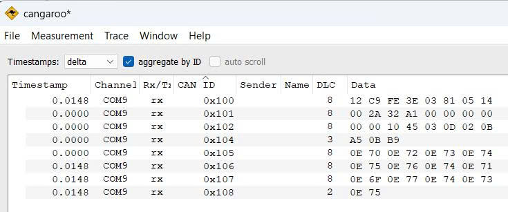
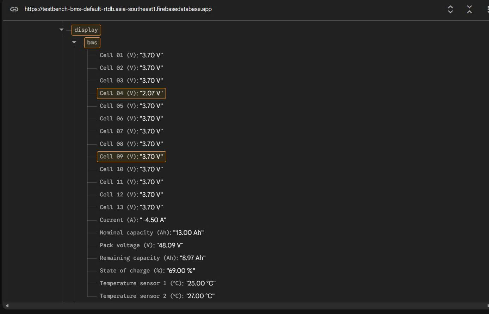

# BMS Data Acquisition and Monitoring

## 1.Mục tiêu

- Thu thập dữ liệu BMS: STM32 gửi request và nhận phản hồi từ BMS pack pin 13S5P thông qua giao thức UART
- Giải mã frame: Đọc điện áp pack, dòng điện, nhiệt độ và điện áp của 13 nhóm cell
- Truyền dữ liệu CAN: Đóng gói các frame đã giải mã thành CAN frame để thiết bị khác sử dụng (Capstone Project)
- Giám sát từ xa (đang phát triển): ESP32 nhận dữ liệu CAN và đẩy lên Firebase

## 2.Sơ đồ đấu nối phần cứng 

Sử dụng STM32F1 với ESP32với sơ đồ chân chi tiết:

| Module            | Chân trên module     | Chân STM32 | Chân ESP32  |
|-------------------|----------------------|------------|-------------|
| JBD BMS           | TX, RX               | PA10, PA9  |             |
| CAN Transceiver   | CANTX, CAN RX        | PA12, PA11 | 4, 5        |

## 3.Luồng hoạt động

1. STM32F1 gửi request frame `0x03` qua giao thức UART để đọc thông tin cơ bản, trạng thái của Pack Pin
2. STM32F1 nhận được response frame (thông tin cơ bản, trạng thái của pack pin)
3. STM32F1 nhận đủ response frame `0x03`, kiểm tra frame và tiếp tục gửi request frame `0x04` qua giao thức UART để đọc điện áp từng nhóm cell
4. STM32F1 nhận được response frame (điện áp từng nhóm cell)
5. STM32F1 giải mã dữ liệu và đóng gói thành các CAN frame
6. Các node trên CAN bus nhận dữ liệu theo CAN ID tương ứng.
7. ESP32 nhận dữ liệu CAN và gửi lên Firebase (đang phát triển)

## 4. Giao thức UART với BMS 

| Command   | Thông tin                                                                     | Độ dài dữ liệu    |
|-----------|-------------------------------------------------------------------------------|-------------------|
| `0x03`    | Total Voltage, Current, balance capacity, balance status, RSOC, Temp senor,...| 27 byte           |
| `0x04`    | Voltae of cell series                                                         | 26 byte           |

## 5. Định dạng dữ liệu CAN

Giao thức CAN sử dụng Standard ID với kiểu frame là Dataframe

| CAN ID    | DLC       | Data                                                                                                      |
|-----------|-----------|-----------------------------------------------------------------------------------------------------------|
| `0x100`   | 8         | Total Voltage, Current, Balance Capacity, Rate Capacity                                                   |
| `0x101`   | 8         | Cycle, Production date, balance status, balance status high                                               |
| `0x102`   | 8         | Protection status, SW version, RSOC, FET Ctrl sts, Battery series, NTC number, Temp sensor 1(High byte)   |
| `0x104`   | 3         | Temp sensor 1(low byte), Temp sensor 2                                                                    |
| `0x105`   | 8         | Voltage of cell series (1 - 4)                                                                            |
| `0x106`   | 8         | Voltage of cell series (5 - 8)                                                                            |
| `0x107`   | 8         | Voltage of cell series (9 - 12)                                                                           |
| `0x108`   | 2         | Voltage of cell series 13                                                                                 |

## 6. Kết quả kiểm thử & debug

- **UART/JBD BMS:** Frame phản hồi `0x03` và `0x04` được STM32F1 nhận và giải mã

 

- **CAN bus:** Các frame `0x100`–`0x102` và `0x104`–`0x108`

 

- **FireBase** Kết quả hiển thị BMS

 

## Datasheet JBD BMS 

- [Datasheet JBD BMS](docs/datasheet/datasheet_JBD_RS485.pdf)